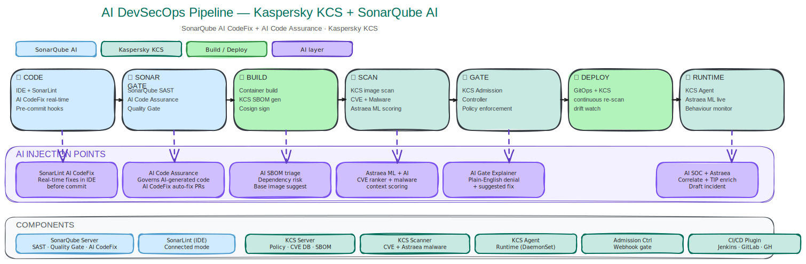
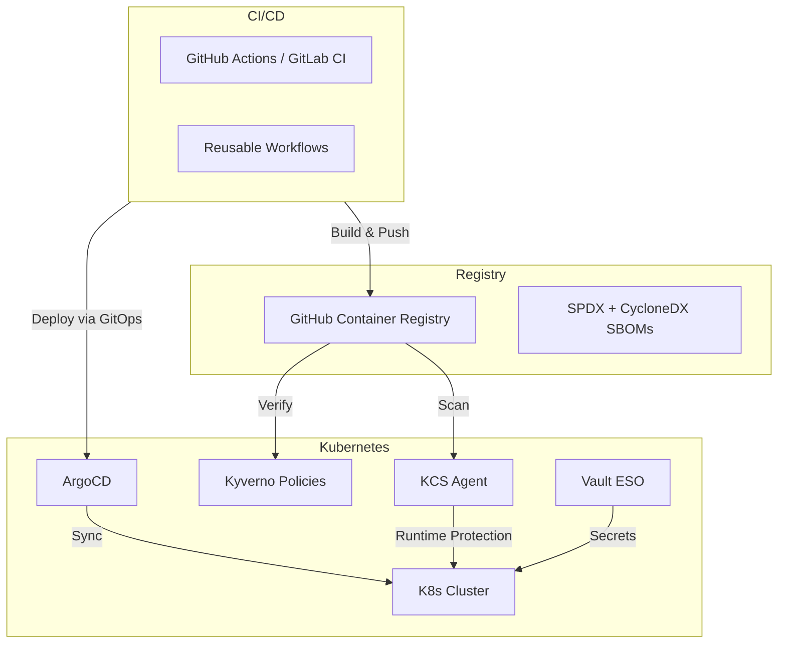

# DevSecOps Pipeline — Reference Implementation

A comprehensive, production-grade DevSecOps pipeline reference implementation demonstrating security at every stage of the container software supply chain — from code commit to runtime protection.

---

## Overview

This repository serves as a **blueprint for building a complete DevSecOps pipeline**. It combines industry-standard security tools with a real FastAPI application, Kubernetes infrastructure, and GitOps deployment to show how security can be enforced end-to-end.

### What It Covers

| Domain | Tools |
|--------|-------|
| **SAST / Code Quality** | Ruff, Flake8, Mypy, Bandit, Pydocstyle, isort, Hadolint, yamllint, markdownlint |
| **Static Analysis** | SonarQube Cloud with quality gate and AI features |
| **Container Build** | Docker BuildKit + Syft (SPDX & CycloneDX SBOM) |
| **Container Scanning** | Trivy (vulnerability, config, secrets) + Kaspersky KCS (malware, policy, runtime) |
| **Supply Chain Security** | Cosign key-based image signing + SBOM attestation |
| **Policy as Code** | Kyverno (image verification, signature validation) |
| **Secrets Management** | HashiCorp Vault + External Secrets Operator (ESO) |
| **GitOps Deployment** | ArgoCD + Kustomize (dev/staging/prod overlays) |
| **Runtime Protection** | Kaspersky KCS Agent (eBPF-based file/process/network monitoring) |
| **CI/CD Orchestration** | GitHub Actions (8 reusable workflows) + GitLab CI (templates) |

---

## Architecture

The pipeline enforces security across 8 sequential stages, each gating the next:



### Infrastructure Overview



---

## Pipeline Stages

| # | Stage | Tool(s) | Purpose | Gating |
|---|-------|---------|---------|--------|
| 🔴 | **Lint** | Ruff, Flake8, Mypy, Bandit, Hadolint, Checkov, yamllint, markdownlint | Code quality, SAST, IaC security | Warnings |
| 🟡 | **Test** | pytest, pytest-cov, PostgreSQL 16, Redis 7 | Unit + integration + security tests (≥80% coverage) | Coverage threshold |
| 🟠 | **SonarQube** | SonarQube Cloud (sonar-scanner) | Static analysis, quality gate, AI CodeFix | Quality Gate (PASS/FAIL) |
| 🔵 | **Build** | Docker BuildKit, Syft | Multi-stage image, SPDX + CycloneDX SBOM | Build success |
| 🟣 | **Scan** | Trivy + Kaspersky KCS | Vulnerability, malware, config & secret scanning | Zero critical/high findings |
| 🟢 | **Sign** | Cosign (key-based) | Image + SBOM signing, signature verification | Signature created |
| 🚀 | **Deploy** | ArgoCD + Kustomize | GitOps deployment to dev/staging/prod | Sync & health OK |
| 🔭 | **Runtime** | KCS Agent (DaemonSet) | File threat protection, process/network control, Astraea ML | Continuous |

### Stage Dependencies

```text
lint ──→ test ──→ sonarqube ──→ build ──→ scan ──→ sign ──→ security-summary ──→ deploy
                                                                                        │
                                                                              (main branch only)
```

- **build, scan, sign** run only on `main` and `release/*` branches
- **deploy** runs only on `main` branch

---

## What This POC Demonstrates

- **Shift-left security** with lint-stage SAST (Bandit, Checkov)
- **Automated testing** with security test cases
- **SBOM generation** in SPDX and CycloneDX formats
- **Image signing** with Cosign
- **GitOps deployment** with ArgoCD
- **External secrets** management with Vault ESO
- **Image verification** with Kyverno policies
- **Policy enforcement** at build and deploy time
- **Container security** with Kaspersky KCS (image scanning, admission control, runtime protection)

---

## CI/CD Pipelines

### GitHub Actions

The pipeline is built as a **modular orchestrator** with 8 reusable workflows:

| Workflow | File | Purpose |
|----------|------|---------|
| **Orchestrator** | `.github/workflows/devsecops-pipeline.yml` | Calls all sub-workflows in sequence with inputs/secrets |
| lint | `.github/workflows/lint.yml` | SAST, code quality, IaC scanning |
| test | `.github/workflows/test.yml` | pytest with PostgreSQL + Redis services |
| sonarqube | `.github/workflows/sonarqube.yml` | SonarCloud scan + quality gate + metrics |
| build | `.github/workflows/build.yml` | Docker build + push + Syft SBOM (with dotenv outputs) |
| scan | `.github/workflows/scan.yml` | Trivy vulnerability/config/secret scan |
| sign | `.github/workflows/sign.yml` | Cosign key-based signing + SBOM attestation |
| deploy | `.github/workflows/deploy.yml` | Kustomize edit + git commit + ArgoCD sync |
| security-summary | `.github/workflows/security-summary.yml` | Aggregate status table, fail on critical failures |

**Cross-repo usage:**

```yaml
jobs:
  lint:
    uses: ahmed-magdi2712/DevSecOps-Usecase/.github/workflows/lint.yml@main
    with:
      python-version: '3.12'
```

### GitLab CI

Equivalent pipeline in the `gitlab_ci/` directory, with 8 template files:

| Template | File |
|----------|------|
| Orchestrator | `gitlab_ci/.gitlab-ci.yml` |
| Lint | `gitlab_ci/templates/lint.yml` |
| Test | `gitlab_ci/templates/test.yml` |
| SonarQube | `gitlab_ci/templates/sonarqube.yml` |
| Build & SBOM | `gitlab_ci/templates/build.yml` |
| Scan (Trivy) | `gitlab_ci/templates/scan.yml` |
| Sign | `gitlab_ci/templates/sign.yml` |
| Deploy | `gitlab_ci/templates/deploy.yml` |
| Security Summary | `gitlab_ci/templates/security-summary.yml` |

A **KCS-specific GitLab CI variant** is also available in `KCS/gitlab-pipeline/`, documented in detail in [`KCS/KCS GitLab CI Pipeline.md`](./KCS/KCS%20GitLab%20CI%20Pipeline.md).

**Cross-project usage:**

```yaml
include:
  - project: 'ahmed-magdi2712/DevSecOps-Usecase'
    file: '/gitlab_ci/templates/lint.yml'
    ref: main
```

---

## Kaspersky Container Security (KCS) Integration

[Kaspersky Container Security](https://www.kaspersky.com/kcs) is integrated as the image vulnerability scanner, admission controller, and runtime protection layer. It enforces security policies across the container lifecycle — from image scanning in CI/CD to runtime protection in production.

### KCS Coverage

| Stage | KCS Component | Function | Policy / Config |
|-------|--------------|----------|-----------------|
| 🔵 Build | **SBOM Ingestion** | SPDX/CycloneDX SBOM enriched for CVE matching | — |
| 🟣 Scan | **KCS Scanner** | CVE, malware, config error & sensitive data detection | [Scanner Policy](./KCS/KCS%20Use%20Case.md#4-scanner-policy) + [Assurance Policy](./KCS/KCS%20Use%20Case.md#5-assurance-policy-cicd-gating) |
| 🚪 Gate | **KCS Admission Controller** | Blocks non-compliant images at deploy time | [Runtime Policy](./KCS/KCS%20Use%20Case.md#6-runtime-policy-admission-control) (Enforce) |
| 🔭 Runtime | **KCS Agent** (DaemonSet) | File threat protection, process/network control | [Runtime Profile](./KCS/KCS%20Use%20Case.md#8-container-runtime-profile-ebpf-based) (auto-profiled) |
| 🟢 Sign | **Cosign Verification** | Image signature verification via KCS integration | [Cosign config](./KCS/KCS%20Use%20Case.md#7-cosign-integration-image-signature-verification) |

### Key Configuration Summary

| Component | Status | Details |
|-----------|--------|---------|
| **Scanner Policy** | ✅ Done | Vulnerabilities, malicious code, config errors, sensitive data — all enabled |
| **Assurance Policy** | ✅ Done | Image marked non-compliant if critical vulns, malware, config errors, or secrets detected |
| **Runtime Policy** (Admission) | ✅ Done | Enforce mode — blocks privileged containers, missing resource limits, `latest` tag |
| **Cosign Signature Verification** | ✅ Done | KCS validates image signatures before allowing deployment |
| **Runtime Profile** (eBPF) | ✅ Done | File threat protection (enforce), process/network control (auto-profiled), FS monitoring |

> **Full documentation:**
>
> - [KCS Use Case & Configuration](./KCS/KCS%20Use%20Case.md) — Detailed setup for scanner, assurance, runtime policies, Cosign integration, and runtime profile
> - [KCS GitLab CI Pipeline Reference](./KCS/KCS%20GitLab%20CI%20Pipeline.md) — Complete 8-stage GitLab CI pipeline with KCS as the core scanner

---

## Security Tools Configuration

### SAST / Linting

The lint stage runs multiple static analysis tools in parallel, covering Python, Docker, YAML, Markdown, and Kubernetes manifests.

**Python Linters:**

| Tool | Category | What It Checks | Config File |
|------|----------|----------------|-------------|
| **Ruff** | Python linter/formatter | Style, errors, complexity, imports — replaces Flake8 + isort | `pyproject.toml` |
| **Flake8** | Python linter | PEP 8 compliance, complexity | `pyproject.toml` |
| **Mypy** | Type checker | Static type correctness | `pyproject.toml` |
| **Bandit** | SAST | Security vulnerabilities in Python code | CLI flags |
| **Pydocstyle** | Docs | Docstring convention compliance | CLI flags |
| **isort** | Import sorting | Import order consistency | `pyproject.toml` |

**Infrastructure & Config Linters:**

| Tool | Target | Checks | Config |
|------|--------|--------|--------|
| **Hadolint** | `docker/Dockerfile` | Dockerfile best practices, security | `.hadolint.yaml` |
| **yamllint** | `k8s/` | YAML syntax and style | `.yamllint` |
| **markdownlint** | `**/*.md` | Documentation formatting | `.markdownlint.json` |
| **Checkov** | `k8s/` | IaC security (CIS Kubernetes benchmarks) | CLI flags |

**Usage:**

```bash
# Python linting
ruff check src/ --fix
mypy src/ --ignore-missing-imports

# Security linting
bandit -r src/ -ll

# IaC scanning
checkov -d k8s/ --framework kubernetes

# Dockerfile linting
hadolint docker/Dockerfile --failure-threshold warning

# YAML linting
yamllint k8s/

# Markdown linting
markdownlint-cli2 "**/*.md" --config .markdownlint.json
```

### Static Analysis (SonarQube)

SonarQube Cloud performs deep static analysis with AI-powered code review.

**Configuration** (`sonar-project.properties`):

```properties
sonar.projectKey=ahmed-magdi2712_DevSecOps-Usecase
sonar.organization=devsecops-poc
sonar.python.coverage.reportPaths=reports/coverage.xml
sonar.qualitygate.wait=true
```

**CI Integration:** The pipeline downloads test coverage reports, runs `sonar-scanner`, waits for the quality gate, and publishes a metrics summary (bugs, vulnerabilities, code smells, coverage, duplication, security hotspots) via the SonarQube API.

**VS Code Integration:**

1. Install the [SonarQube extension](https://marketplace.visualstudio.com/items?itemName=SonarSource.sonarlint-vscode)
2. Connect to SonarQube Cloud (`Ctrl+Shift+P` → "SonarQube: Connect to SonarQube")
3. Organization: `devsecops-poc`

**Local CLI:**

```bash
sonar-scanner -Dsonar.projectKey=ahmed-magdi2712_DevSecOps-Usecase
```

### Container Scanning (Trivy)

[Trivy](https://github.com/aquasecurity/trivy) runs three scan types against the built image and Kubernetes manifests:

| Scan Type | Target | Format | Severity Threshold |
|-----------|--------|--------|-------------------|
| **Vulnerability** | Container image | SARIF (uploaded to GitHub Security) | CRITICAL, HIGH |
| **Configuration** | `k8s/` directory | Table (human-readable) | CRITICAL, HIGH |
| **Secrets** | Container image | JSON | All findings |

**Key configuration:**

- `exit-code: 1` — pipeline fails on any finding above threshold
- `.trivyignore` — suppresses known false positives (CVEs with no fix, benign K8s misconfigs)
- `.trivy-secret.yaml` — custom secret patterns for this project
- `ignore-unfixed: true` — only fail on vulnerabilities with available fixes

### Container Security (Kaspersky KCS)

KCS provides deeper container-specific security beyond traditional CVE scanning:

| Capability | What It Detects | Enforcement |
|------------|----------------|-------------|
| **Image Scanner** | CVEs, malware, config errors, sensitive data | CI/CD gate (Assurance Policy) |
| **Admission Controller** | Non-compliant images, privilege escalation, `latest` tag | Block at deploy time |
| **Runtime Agent** | File threats, anomalous processes, network attacks | Enforce + Audit |
| **SBOM Ingestion** | SPDX/CycloneDX enrichment for CVE matching | Pipeline integration |

> See [KCS Use Case & Configuration](./KCS/KCS%20Use%20Case.md) for the complete setup guide including scanner policies, assurance rules, runtime profiles, and Cosign verification integration.

### Image Signing (Cosign)

[Cosign](https://github.com/sigstore/cosign) provides container image signing and verification using a private/public key pair:

- **Signing:** Image is signed with the private key, annotated with metadata (repo, SHA, actor, pipeline ID)
- **SBOM Attestation:** SPDX SBOM is attached to the image and independently signed
- **Verification:** Both image signature and SBOM attachment are verified before deployment
- **Kyverno Integration:** Kyverno policies enforce that only signed images from trusted registries are deployed

### Policy as Code (Kyverno)

[Kyverno](https://kyverno.io/) enforces security policies at the Kubernetes level:

| Policy | Kind | Effect | Description |
|--------|------|--------|-------------|
| **Image Policy** | `ClusterPolicy` | Enforce | Blocks images from untrusted registries (non-ghcr), verifies Cosign signatures |
| **Signed Images** | `NamespacedImageValidatingPolicy` | Audit | Validates image signatures using the Cosign public key |

Policies are in `k8s/kyverno/` and are applied during the deploy stage.

### Secrets Management (Vault ESO)

[HashiCorp Vault](https://www.vaultproject.io/) + [External Secrets Operator](https://external-secrets.io/) manages secrets declaratively:

| Resource | Name | What It Manages |
|----------|------|-----------------|
| `ClusterSecretStore` | `vault-backend` | Connection to Vault with Kubernetes auth |
| `ExternalSecret` | `secureapp-secrets` | DB_URL, REDIS_URL, SECRET_KEY, JWT secret, API keys |
| `ExternalSecret` | `postgres-credentials` | PostgreSQL username and password |

Configuration in `k8s/vault-eso/`. Applied via `kustomize build k8s/vault-eso | kubectl apply -f -`.

---

## OpenCode AI Assistant

OpenCode is integrated via `.github/workflows/opencode.yml` as an AI pair programmer on GitHub.

### Trigger Commands

| Command | Description |
|---------|-------------|
| `/oc` | Run OpenCode on PR/issue |
| `/opencode` | Alternative trigger |
| `@opencode` | Mention to trigger |

### Usage Examples

**On PR Comment:**

```text
/oc review this code and suggest improvements
/oc fix the security vulnerability in src/app/auth.py
/oc add unit tests for the user service
```

**On Issue Comment:**

```text
/opencode how do I implement JWT authentication?
/oc explain the CI/CD pipeline flow
```

### Required Permissions

- `id-token: write` — OIDC authentication
- `contents: read` — Read repository code
- `pull-requests: read` — Read PR context
- `issues: read` — Read issue context

### GitHub Secret

Add `OPENCODE_API_KEY` to GitHub secrets for authentication.

---

## Kubernetes Infrastructure

### Base Manifests (`k8s/base/`)

| Resource | Details |
|----------|---------|
| **Deployment** | 2 replicas, RollingUpdate, non-root securityContext, read-only root filesystem |
| **Service** | ClusterIP on port 80 → 8000 |
| **ConfigMap** | Environment variables, log level, worker count |
| **Ingress** | NGINX Ingress, TLS with cert-manager + Let's Encrypt |
| **HPA** | CPU 70% / Memory 80%, min 2 max 10 replicas |
| **PDB** | PodDisruptionBudget — min 1 available |
| **NetworkPolicy** | Restrictive: only ingress-nginx ingress, egress to postgres/redis/DNS |
| **PostgreSQL** | StatefulSet (1 replica), 10Gi PVC, health checks |
| **Redis** | StatefulSet (1 replica), 5Gi PVC, headless + client services |

### Environment Overlays (`k8s/overlays/`)

| Environment | Namespace | Replicas | Resource Limits | Ingress |
|-------------|-----------|----------|-----------------|---------|
| **dev** | `secureapp-dev` | 1 | Low | Internal |
| **staging** | `secureapp-staging` | 2 | Medium | Staging TLS |
| **prod** | `secureapp-prod` | 3 | High | Production TLS, HPA 3-20 |

### Kyverno Policies (`k8s/kyverno/`)

- **Image Policy:** ClusterPolicy enforcing trusted registries (ghcr.io only) + Cosign signature verification
- **Signed Images Policy:** NamespacedImageValidatingPolicy verifying signatures against the public key

### Vault ESO (`k8s/vault-eso/`)

- **ClusterSecretStore:** Backed by HashiCorp Vault with Kubernetes service account authentication
- **ExternalSecrets:** Application secrets (DB, Redis, JWT) + database credentials

---

## Pre-commit Hooks

### Installation

```bash
pip install pre-commit
pre-commit install
pre-commit run --all-files
```

### Available Hooks

| Hook | Purpose | Status |
|------|---------|--------|
| gitleaks | Detect secrets in code | ✅ |
| trailing-whitespace | Remove trailing whitespace | ✅ |
| detect-private-key | Catch raw PEM/RSA keys | ✅ |
| check-added-large-files | Prevent large file commits (>512KB) | ✅ |
| hadolint-docker | Lint Dockerfiles | ✅ |
| checkov | IaC security scanning | ✅ |

Configuration: `.pre-commit-config.yaml`

---

## Project Structure

```text
.
├── .github/
│   ├── buildkitd.toml              # Docker BuildKit daemon config
│   └── workflows/
│       ├── devsecops-pipeline.yml   # Pipeline orchestrator
│       ├── lint.yml                 # Reusable: SAST & code quality
│       ├── test.yml                 # Reusable: pytest with PG + Redis
│       ├── sonarqube.yml            # Reusable: SonarQube scan
│       ├── build.yml                # Reusable: Docker build + SBOM
│       ├── scan.yml                 # Reusable: Trivy scanning
│       ├── sign.yml                 # Reusable: Cosign signing
│       ├── deploy.yml               # Reusable: ArgoCD GitOps deploy
│       ├── security-summary.yml     # Reusable: Pipeline summary
│       └── opencode.yml             # AI assistant integration
│
├── gitlab_ci/
│   ├── .gitlab-ci.yml              # GitLab CI orchestrator
│   └── templates/                   # Modular GitLab CI templates
│       ├── lint.yml
│       ├── test.yml
│       ├── sonarqube.yml
│       ├── build.yml
│       ├── scan.yml
│       ├── sign.yml
│       ├── deploy.yml
│       └── security-summary.yml
│
├── KCS/
│   ├── KCS Use Case.md             # Full KCS configuration guide
│   ├── KCS GitLab CI Pipeline.md   # GitLab CI pipeline with KCS
│   └── gitlab-pipeline/            # KCS pipeline YAML files
│
├── k8s/
│   ├── base/                        # Base K8s manifests
│   │   ├── deployment.yaml, service.yaml, configmap.yaml
│   │   ├── ingress.yaml, hpa.yaml, pdb.yaml
│   │   ├── networkpolicy.yaml
│   │   ├── postgres.yaml, redis.yaml
│   │   └── kustomization.yaml
│   ├── overlays/
│   │   ├── dev/                    # Dev environment overlay
│   │   ├── staging/                # Staging environment overlay
│   │   └── prod/                   # Production environment overlay
│   ├── kyverno/                     # Kyverno policy as code
│   │   ├── image-policy.yaml       # Block untrusted registries
│   │   └── signed-images-policy.yaml # Cosign signature verification
│   └── vault-eso/                   # External Secrets Operator
│       ├── cluster-secret-store.yaml
│       ├── app-external-secret.yaml
│       └── database-external-secret.yaml
│
├── docker/
│   ├── Dockerfile                   # Multi-stage production image
│   └── prometheus.yml               # Prometheus scrape config
│
├── architecture/
│   ├── AI-DevSecOps-Pipeline-*.excalidraw  # Architecture diagrams
│   └── AI-DevSecOps-Pipeline-*.svg         # Rendered diagrams
│
├── argocd/
│   └── secureapp-dev.yaml          # ArgoCD Application definition
│
├── src/                            # Sample FastAPI application
│   └── app/
│       ├── api/v1/                 # API endpoints
│       ├── core/                   # Config, security, logging
│       ├── models/                 # ORM models
│       ├── schemas/                # Pydantic schemas
│       ├── services/               # Business logic
│       ├── tests/                  # Unit, integration, security tests
│       └── main.py                 # Application factory
│
├── .pre-commit-config.yaml         # Pre-commit hook definitions
├── .hadolint.yaml                  # Hadolint rules (ignore DL3008/DL3013)
├── .yamllint                       # YAML linting rules
├── .markdownlint.json              # Markdown linting rules
├── .trivyignore                    # Suppressed CVEs and misconfigs
├── .trivy-secret.yaml              # Custom secret patterns
├── sonar-project.properties        # SonarQube project config
├── pyproject.toml                  # Python tooling config (Ruff, Mypy, etc.)
├── pytest.ini                      # Pytest markers and settings
├── docker-compose.yml              # Local development stack
└── csv.tmpl                        # Syft CSV template for SBOM table
```

---

## Prerequisites & Secrets

### Required Accounts

| Service | Purpose | Free Tier? |
|---------|---------|-----------|
| **GitHub** | Repository, Actions, Container Registry | ✅ Yes (public) |
| **SonarCloud** | Static code analysis | ✅ Yes (public) |
| **HashiCorp Vault** | Secrets management | Self-hosted or Cloud |
| **ArgoCD** | GitOps deployment | Self-hosted on K8s |
| **Kaspersky KCS** | Container security | Trial or licensed |
| **Sigstore Cosign** | Image signing | ✅ Free (open-source) |

### GitHub Secrets

| Secret | Description | Required For |
|--------|-------------|-------------|
| `SONAR_TOKEN` | SonarQube authentication token | sonarqube stage |
| `ARGOCD_SERVER` | ArgoCD server hostname | deploy stage |
| `ARGOCD_TOKEN` | ArgoCD authentication token | deploy stage |
| `COSIGN_PRIVATE_KEY` | Cosign private key | sign stage |
| `COSIGN_PASSWORD` | Cosign private key passphrase | sign stage |
| `COSIGN_PUBLIC_KEY` | Cosign public key for verification | sign stage + Kyverno |
| `GIT_TOKEN_COMMIT` | Git token for committing manifest changes | deploy stage |
| `OPENCODE_API_KEY` | OpenCode AI authentication | opencode workflow |

### GitHub Variables

| Variable | Description |
|----------|-------------|
| `COSIGN_PUBLIC_KEY` | Cosign public key (also usable as variable) |

### KCS Variables (for GitLab CI)

See [KCS Use Case](./KCS/KCS%20Use%20Case.md) for the full variable reference.

---

## How to Adopt This Pipeline

To use this pipeline in your own project:

### 1. Clone and Explore

```bash
git clone https://github.com/ahmed-magdi2712/DevSecOps-Usecase.git
cd DevSecOps-Usecase
```

### 2. Choose Your CI Platform

- **GitHub Actions:** Copy the workflows from `.github/workflows/` and reference them via `uses:`
- **GitLab CI:** Copy templates from `gitlab_ci/` or use `include:project:` from this repo

### 3. Configure Secrets

Add the required secrets from the [Prerequisites & Secrets](#prerequisites--secrets) section to your CI/CD settings.

### 4. Point to Your Registry

Change `REGISTRY` and `IMAGE_NAME` in:

- GitHub: `devsecops-pipeline.yml` top-level `env:` block
- GitLab CI: `.gitlab-ci.yml` top-level `variables:` block

### 5. Customize K8s Manifests

Update `k8s/overlays/<env>/kustomization.yaml` with your:

- Image repository
- Namespace
- Resource limits
- Ingress hostnames

### 6. Set Up ArgoCD

Create an ArgoCD Application (see `argocd/secureapp-dev.yaml` as reference) pointing to your forked repo's Kustomize overlay path.

### 7. Configure SonarQube

Create a SonarQube Cloud project and update `sonar-project.properties` with your project key and organization.

### 8. (Optional) Integrate KCS

Follow the [KCS Use Case](./KCS/KCS%20Use%20Case.md) guide to set up:

- Scanner and assurance policies
- Admission controller
- Runtime agent
- Cosign signature verification

---

## License

MIT
